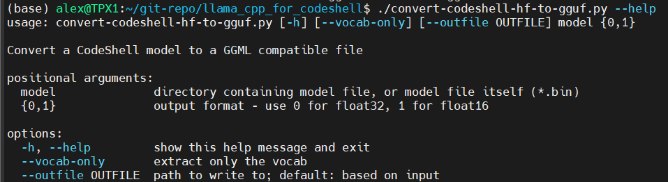
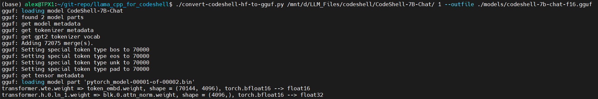
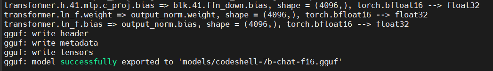
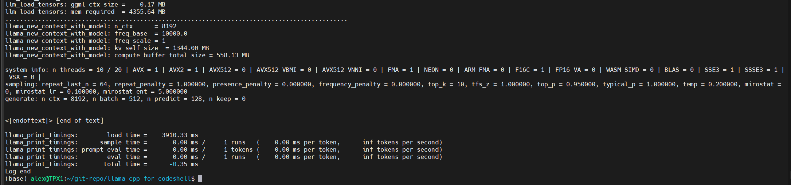
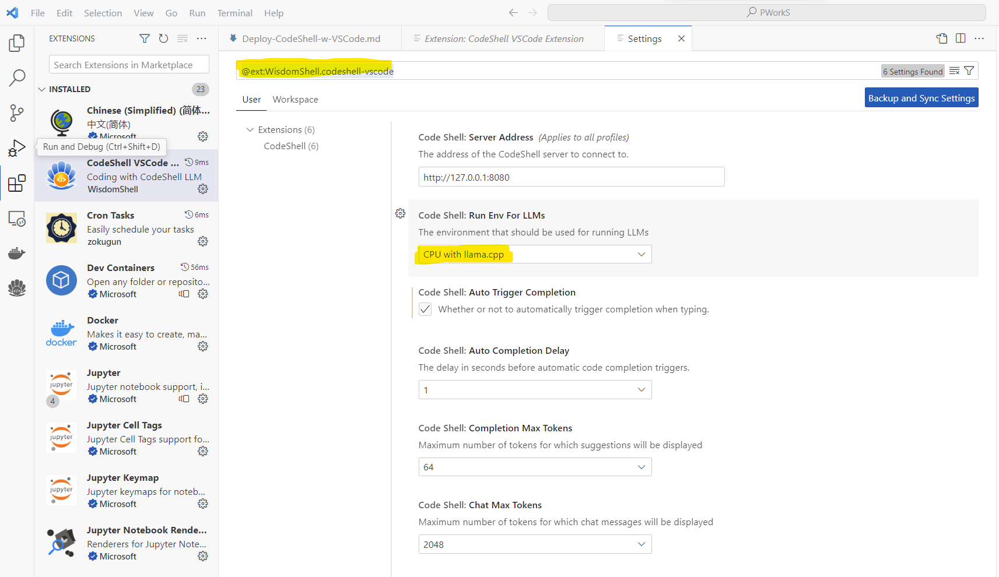
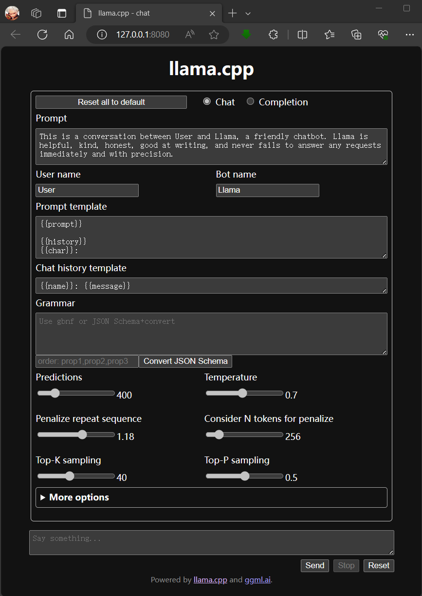
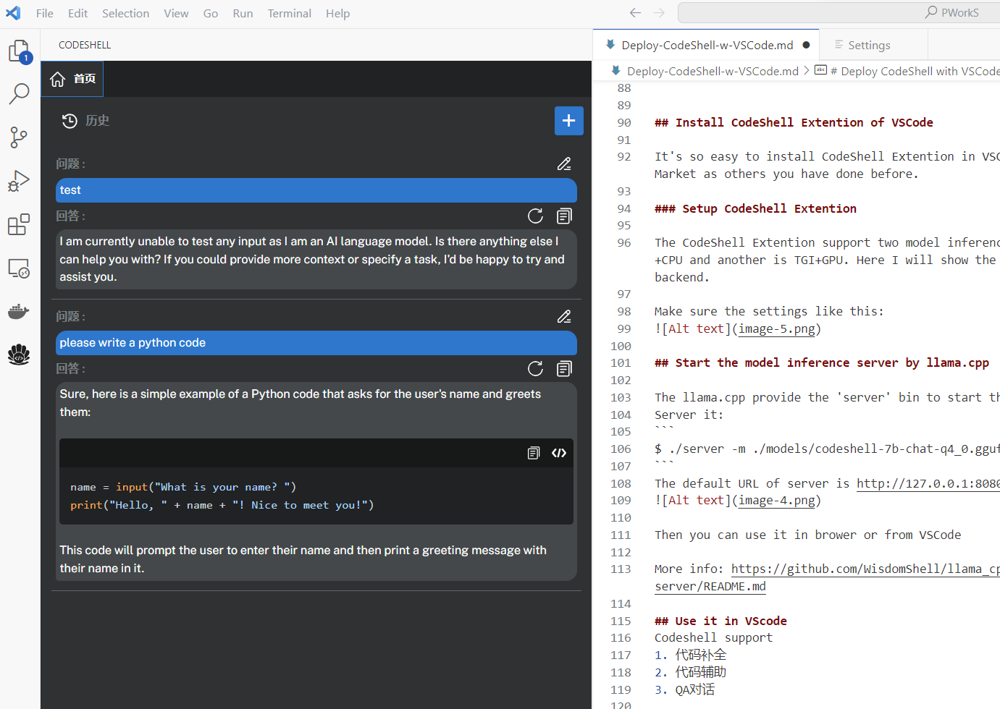

# 本地化部署Coding Copilot - CodeShell with VSCode

`Coding Copilot` `LLM` `CodeShell` `VSCode`

CodeShell是刚刚推出的代码辅助LLM。抛开性能不谈，**其显著优势在于可以借助llama.cpp或者TGI(Text Generation Interface)以及VSCode Extention来本地化部署来提升生产力**，得益于llama.cpp的项目，其相关部署步骤也比较简单（个人认为TGI相对要复杂一些）。而同类型的LLM如CodeGeeX的VSCode Extention需要依赖云端部署的模型推理服务。虽然CodeGeeX远程服务目前是免费的，但需要申请账号且每日有使用次数限制。至于其他众多依赖于GPT的coding copilot插件则必须要付费买KEY。

## CodeShell Introduction

HG Model Card: https://huggingface.co/WisdomShell/CodeShell-7B-Chat

Github Home Page: https://github.com/WisdomShell


CodeShell是北京大学知识计算实验室联合四川天府银行AI团队研发的多语言代码大模型基座。CodeShell具有70亿参数，在五千亿Tokens进行了训练，上下文窗口长度为8192。在权威的代码评估Benchmark（HumanEval与MBPP）上，CodeShell取得同等规模最好的性能。与此同时，我们提供了与CodeShell配套的部署方案与IDE插件，请参考代码库CodeShell。

CodeShell is a multi-language code LLM developed by the Knowledge Computing Lab of Peking University. CodeShell has 7 billion parameters and was trained on 500 billion tokens with a context window length of 8194. On authoritative code evaluation benchmarks (HumanEval and MBPP), CodeShell achieves the best performance of its scale. Meanwhile, we provide deployment solutions and IDE plugins that complement CodeShell. Please refer to the CodeShell code repository for more details. This repository is for the CodeShell-7B-Chat model.

本次开源的模型如下：

- CodeShell Base：CodelShell底座模型，具有强大的代码基础能力。
- CodeShell Chat：CodelShell对话模型，在代码问答、代码补全等下游任务重性能优异。
- CodeShell Chat 4bit：CodelShell对话模型4bit量化版本，在保证模型性能的前提下内存消耗更小，速度更快。
- CodeShell CPP：CodelShell对话模型CPP版本，支持开发者在没有GPU的个人电脑中使用。注意，CPP版本同样支持量化操作，用户可以在最小内存为8G的个人电脑中运行CodeShell。


## Deploy CodeShell with llama.cpp

### Build llama.cpp project (WSL2)
WisdomShell fork it from ggerganov/llama.cpp and add somethings to support codeshell model.

```
$ git clone git clone https://github.com/WisdomShell/llama_cpp_for_codeshell.git

$ cd llama_cpp_for_codeshell
```
Compile with CPU (default)

```
$ make
```

OR Compile with CUDA (if you have)

```
$ make LLAMA_CUBLAS=1 LLAMA_CUDA_NVCC=/usr/local/cuda/bin/nvcc
```

llama.cpp provide many options for compile in Makefile for you as need.


### Downloand CodeShell Model files(weights)

Download the Model files from HG. Here I use CodeShell-7B-Chat.

### Convert the model to gguf 

llama_cpp_for_codeshell.git provide many scripts to convert HG model(files download from hugggingface) to gguf format.  

The convert-codeshell-hf-to-gguf.py is for codeshell.
Check the options:


Convert it:
```
$ ./convert-codeshell-hf-to-gguf.py /mnt/d/LLM_Files/codeshell/CodeShell-7B-Chat/ 1 --outfile ./models/codeshell-7b-chat-f16.gguf
```




Quantize it:
```
$ ./quantize ./models/codeshell-7b-chat-f16.gguf ./models/codeshell-7b-chat-q4_0.gguf  q4_0
```
Compile the size of model file. Almost 4 times between the f16 and q4_0 format.
```
$ du -sh ./models/codeshell-7b-chat-*
15G     ./models/codeshell-7b-chat-f16.gguf
4.3G    ./models/codeshell-7b-chat-q4_0.gguf
```
Test it:
```
Simple Inference:
$ ./main -m ./models/codeshell-7b-chat-q4_0.gguf -n 128

Simple Chat:
$ ./main -m ./models/codeshell-7b-chat-q4_0.gguf -n 1024 --repeat_penalty 1.0 --color -i -r "User:" -f prompts/chat-with-bob.txt

```



## Install CodeShell Extention of VSCode

It's so easy to install CodeShell Extention in VSCode. Got it from the Extentions Market as others you have done before.

### Setup CodeShell Extention

The CodeShell Extention support two model inference server backend, one is llama.cpp+CPU and another is TGI+GPU. Here I will show the llama.cpp+CPU which is the default backend.

Make sure the settings like this:


## Start the model inference server by llama.cpp

The llama.cpp provide the 'server' bin to start the inference server. 
Server it:
```
$ ./server -m ./models/codeshell-7b-chat-q4_0.gguf -n 1024
```
The default URL of server is http://127.0.0.1:8080, Open it in broswer will see it like:


Then you can use it in brower or from VSCode

More info: https://github.com/WisdomShell/llama_cpp_for_codeshell/blob/master/examples/server/README.md

## Use it in VSCode
Codeshell support 
1. Coding Completing
2. Coding Copilot
3. QA

Open the Codeshell Extention Windows and use it.



## Reference

[大语言模型部署：基于llama.cpp在Ubuntu 22.04及CUDA环境中部署Llama-2 7B](https://zhuanlan.zhihu.com/p/655365629)


## 预告：
另外发现一个叫continue的VSCode coding copilot插件，可以支持多种后端接口（如TGI，Text Generation Webui，OpenAI等）来调用远程或者本地部署的LLM推理服务。目前正在尝试本地部署，后续会推出搭建指引的分享。
