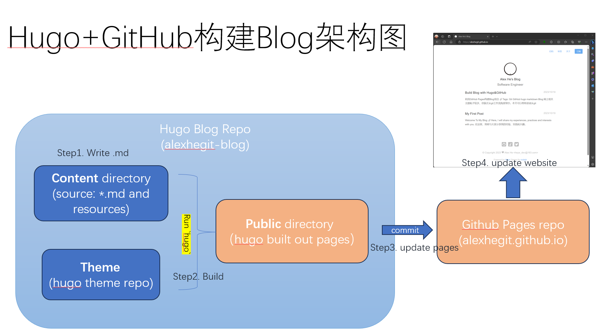
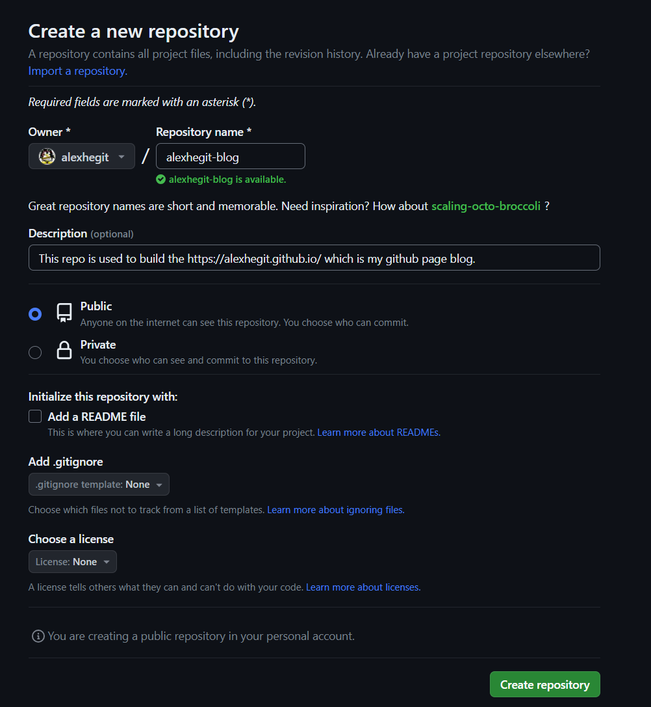
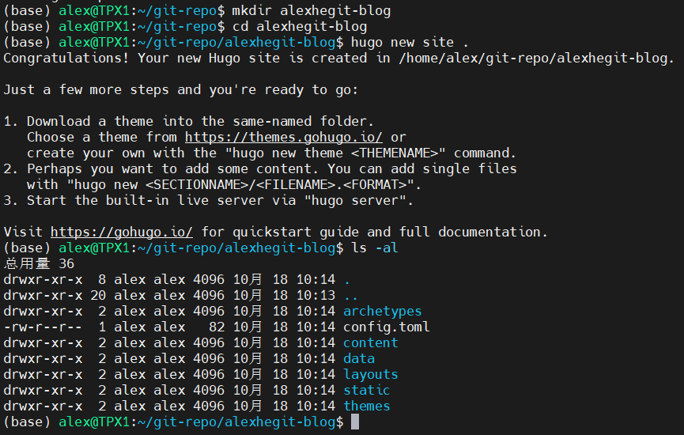
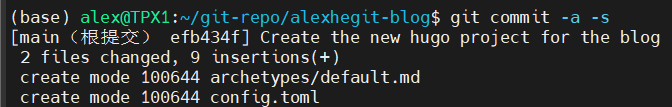
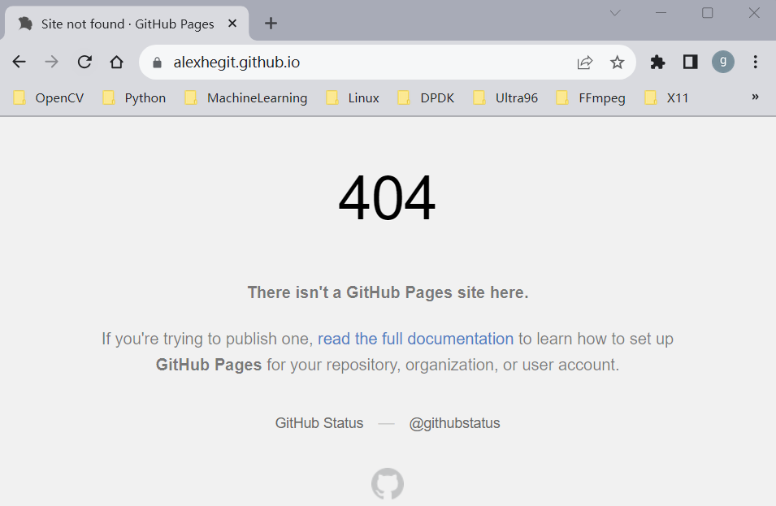
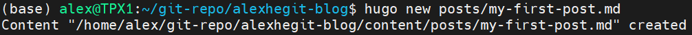
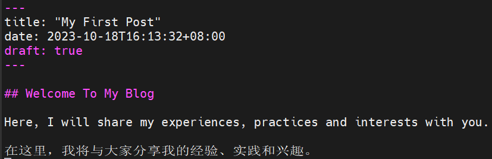
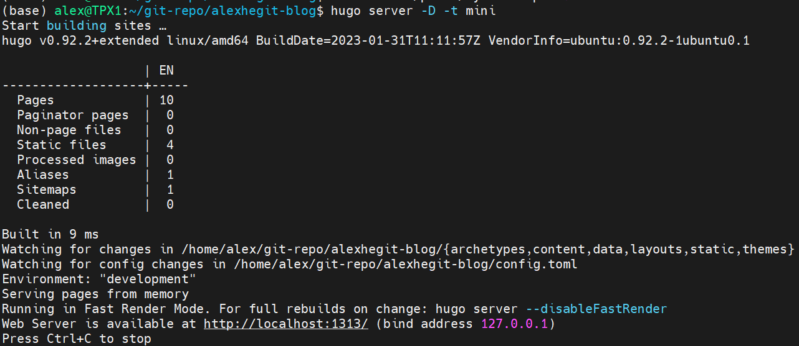
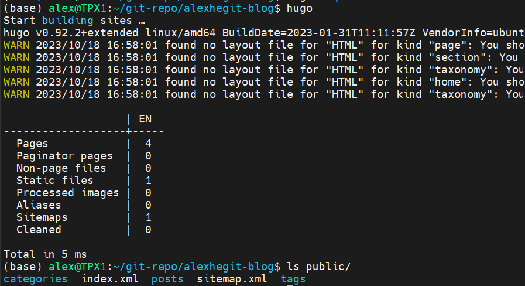

# 利用GitHub Pages构建Blog项目

**Tags**: `Git` `GitHub` `hugo` `markdown` `Blog`

**网上相关主题帖子较多，但缺乏从git工作流角度细节。本文可以帮助读者从git项目维护角度来理解和掌握操作过程，避免小坑**

目前github pages上构建个人blog主流的框架工具有jekyll, hexo, hugo.
通过比对，选择hugo来开发blog静态网站。关于三者的比较可以阅读 [https://zhuanlan.zhihu.com/p/368407566](https://zhuanlan.zhihu.com/p/368407566)

----
# 参考：
- hugo官方网站： [https://gohugo.io/]
- hugo推荐主题：
    - [https://themes.gohugo.io/themes/hugo-theme-cactus-plus/](mini)
    - [https://themes.gohugo.io/themes/hugo-theme-cleanwhite/](cleanwhite)
    - [https://themes.gohugo.io/themes/anatole/](anatole)
    - [https://themes.gohugo.io/themes/hugo-theme-m10c/](m10c)
    - [https://themes.gohugo.io/themes/minimo/](minimo)
- 使用 Hugo + Github 搭建个人博客：[https://zhuanlan.zhihu.com/p/105021100]
- Git中submodule的使用：[https://zhuanlan.zhihu.com/p/87053283]

# Step By Step

**实现思路：**
在github上构建两个repo，一个用于hugo blog内容开发（https://github.com/alexhegit/alexhegit-blog），另一个为部署的GitHub Pages repo (https://github.com/alexhegit/alexhegit.github.io)。
此外，还引用了hugo theme repo。github page repo和hugo theme repo都作为hugo blog repo的submodule, 三者的git提及相对独立。


## 利用github pages构建blog项目
例如我自己的项目名称为alexhegit-blog，后续讲解以此为例。
**NOTE**：这里创建一个空项目，不要创建README。因为，后续用hugo创建网页项目时，hugo要求项目目录为空目录。    


## 使用hugo创建网站项目
创建一个同github blog项目同名的新目录，并用hugo初始化一个网站项目：


常用目录用处如下
| 子目录名称 | 功能 |
| --------- | ---- |
| archetypes | 新文章默认模板 |
| config.toml | `Hugo`配置文档 |
| content | 存放所有`Markdown`格式的文章 |
| layouts | 存放自定义的`view`，可为空 |
| static | 存放图像、CNAME、css、js等资源，发布后该目录下所有资源将处于网页根目录 |
| themes | 存放下载的主题 |

## 将hugo网站项目连接到github
### 在项目目录下，创建第一个patch引入刚刚创建的blog项目文件:
    $ git init
    $ git commit -a -s


### 将hugo blog项目提交到github:
    $ git remote add origin git@github.com:alexhegit/alexhegit-blog.git
    $ git branch -M main
    $ git push -u origin main
**NOTE**：关于远程ssh提交代码，这里假设您已经设置好了ssh key以及GPG key。具体操作可参考文末“一些问题及解决方法”或者github官方文档。

### 在blog项目目录下，以git submodule方式安装mini主题
mini是一个简洁快速的轻量级主题

    $ git submodule add https://github.com/nodejh/hugo-theme-mini.git themes/mini)
    提交相关改动：
    $ git commit -a -s
    $ git push -u origin main

到这一步为止，githug page(blog)是空的，访问结果404.


## 添加首篇blog
### 使用并修改mini的config
参考[https://github.com/nodejh/hugo-theme-mini/blob/master/README.md](https://github.com/nodejh/hugo-theme-mini/blob/master/README.md)相关操作，如下：
在 [exampleSite](https://github.com/nodejh/hugo-theme-mini/tree/master/exampleSite) 目录中有一个 [config.yaml](https://github.com/nodejh/hugo-theme-mini/blob/master/exampleSite/config.yaml) 的配置文件，你可以将其复制到你的项目根目录中，将一些配置项修改为你的配置。这些配置都可以随意修改。

        > ⚠️ 你需要删除这行配置： `themesDir: ../../` 。
        
### 创建第一个Post
    $hugo new posts/my-first-post.md
    该命令将在content目录下创建posts/my-first-post.md。然后，您可以根据需要修改该md文件。


    每一个new post的md文件，包含了title/data等信息，可酌情修改。
    且默认都标记为draft，需要以-D参数方式针对Draft提供渲染服务。正式发布前，需要将"draft true"。修改"draft false"。


    测试发布结果。-D表示draft方式运行， -t指定theme风格。
    $ hugo server -D -t mini


    打开浏览器预览发布，输入http://localhost:1313 可看到结果。可反复修改，直至效果满意。


### 将正式发布编译成静态网页
    在项目更目录下运行"hugo"命令，完成后在子目录public中生成静态网页文件。


## 将生成的静态网页部署到github上
    创建github pages repo
    以自己的github用户名创建一个github pages repo, 例如我的是alexhegit.github.io。具体步骤参考官方文档。
**NOTE** 需要构建一个完全空的项目，不含README及LICENSE（文件）。否则，后续git submodule add时会报错。

### 将生成的Blog网页托管至github pages repo

#### 方法一：将每次Blog项目build出来的静态网站的文件从public拷贝到github pages repo。
- 先克隆github pages repo到本地
- 将Blog网页项目build出来的所有文件从public目录拷贝至本地的github pages repo并进行提交。

#### 方法二：将github pages repo以submodule加入到Blog网页项目中的public目录
- 因为之前构建Blog编译过网页，所以先要删除public目录
- 将github pages repo以submodule加入的Blog网页项目
```  
    $ git submodule add git@github.com:alexhegit/alexhegit.github.io.git public
    $ git commit -a -s
```
- 重新build出静态网页文件
    $ hugo
- 将build出的静态网页commit到github pages repo
```
    $ cd public
    $ git init
    $ git commit -a -s
    $ git branch -M main
    $ git push -u origin main
```

提交完成后，所见即所得 [Alex He's Blog](https://alexhegit.github.io)

## 一些问题及解决方法

- WSL-Ubuntu系统中git使用报错问题解决：GnuTLS recv error (-110): The TLS connection was non-properly terminated   [https://zhuanlan.zhihu.com/p/624555732](https://zhuanlan.zhihu.com/p/624555732)
- 如何为Git生成并设置GPG签名: 
    - 操作参考（已验证）[https://zhuanlan.zhihu.com/p/76861431](https://zhuanlan.zhihu.com/p/76861431)
    - 官方文档：
  
        [adding-a-gpg-key-to-your-github-account](https://docs.github.com/en/authentication/managing-commit-signature-verification/adding-a-gpg-key-to-your-github-account)
    
        [telling-git-about-your-signing-key](https://docs.github.com/zh/authentication/managing-commit-signature-verification/telling-git-about-your-signing-key)
- 如何插入图片: [Hugo 博客插入图片的方法](https://www.yuweihung.com/posts/2021/hugo-blog-picture/)

---------
**欢迎访问我的github blog获取更多经验分享:**
https://alexhegit.github.io

您也可以在 [FlowUs 息流](https://flowus.cn/share/2208be9d-2025-4c78-b6e1-563ded2a1d98)来观看该文原始版本（可视化可能更佳）
